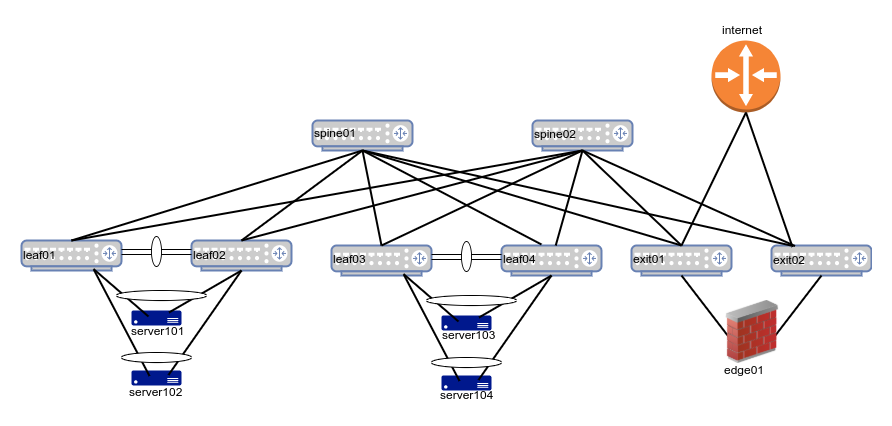

# Cloud Native Data Center Networking
Code repository for the O'Reilly book 'Cloud Native Data Center Networking'. You can get the book either via [Safari](https://learning.oreilly.com/library/view/cloud-native-data/9781492045595/) or an online bookseller such as [Amazon](https://www.amazon.com/Cloud-Native-Data-Center-Networking-Architecture/dp/1492045608/).

I have not setup all the relevant code from the book yet, it should be done before the end of November 2019. 

All my code has been tested on a Ubuntu laptop running either 18.04 or 19.04. If you experience an issue, please file a ticket and I'll do what I can to help, no promises. If you send me a fix via a [pull request](https://help.github.com/en/github/collaborating-with-issues-and-pull-requests/creating-a-pull-request), I'll be grateful and incorporate the fix as quickly as I can.

## Software Used

| Software          | Version |
|-------------------|---------|
|[Vagrant](https://www.vagrantup.com/)| 2.2.5|
|[vagrant-libvirt](https://github.com/vagrant-libvirt/vagrant-libvirt)||
|[Ansible](https://www.ansible.com/)| 2.8.4 |
|[FRRouting](https://frrouting.org/)| 7.2 & version in Cumulus 3.7.x|

The vagrant-libvirt link contains instructions on installing libvirt, QEMU and KVM for various Linux distributions. I use libvirt because it spins up VMs in parallel, making the entire setup a breeze on most modern laptops. For example, on my Lenovo Yoga 920 with an i7-8550U processor and 16GB RAM, I can spin up all of the different simulations in less than two minutes, and still have a functioning laptop where I'm browsing, editing code etc. Virtualbox is more universally supported such as on Windows and Macs, but is much slower. Remember to use the Vagrant-vbox file to spin up the simulation using Virtualbox. 

### Vagrant Boxes Used

Vagrant uses VM images called boxes for spinning up the VMs. I use Vagrant boxes that should automatically download the appropriate Vagrant box when you run `vagrant up`. If that doesn't happen, you'll need to download the Vagrant box manually. Some Vagrant boxes such as Arista's needs to be downloaded from their website. You can spin up a libvirt image of Arista's VM using the instructions on this [link](https://codingpackets.com/blog/arista-veos-vagrant-libvirt-box-install).

The Vagrant boxes used in the simulation include:

| Vagrant Box                       | Version     |
|-----------------------------------|-------------|
| CumulusCommunity/cumulus-vx       | > 3.6, < 4.0|
| lipro/ubuntu-16.04-docker-ce      | 1.13.1      |
| yk0/ubuntu-xenial                 | v201606082  |

I use Ubuntu 16.04 because the playbooks haven't been migrated to use Netplan, the method to configure network interfaces, which is used from Ubuntu 18.04 onwards. I also use the specific Ubuntu boxes as they support libvirt images. In many cases, you can convert a Vagrant virtualbox image into a libvirt image via the Vagrant plugin, [vagrant-mutate](https://github.com/sciurus/vagrant-mutate). The docker-ce Ubuntu box removes the need to install Docker. But you can use any other Ubuntu 1604 image that is supported by libvirt, if you wish.

## Repository Organization

There are three main scenarios (each with its own set of subscenarios) that warrant a full and separate simulation. The three scenarios are:

1. Deploying OSPF in a 2-tier Clos topology. This is described in chapter 13 of the book. This has the following additional subscenarios:
   1. Traditional Numbered OSPF
   2. Unnumbered OSPF
   3. OSPF running on the host with containers

2. Deploying BGP in a 2-tier Clos topology. This is described in chapter 15 of the book, and has the following additional subscenarios:
   1. Traditional Numbered BGP
   2. Unnumbered BGP
   3. BGP running on the host with containers

3. Deploying EVPN with VXLAN. This is described in chapter 17 of the book. It too has additional subscenarios which are:
   1. Centralized Routing with eBGP
   2. Distributed Routing with eBGP
   3. OSPF + iBGP with Distributed Routing
   
Each of these scenarios also has validation playbooks as described in chapter 18. Those validation playbooks have been embedded inside each of the appropriate scenarios.

*The topologies used in this github differ from the ones used in the deployment chapters in the book*. They've been simplified and expanded. Simplified by reducing the number of servers to enable the simulation to run on a 16GB RAM laptop. Expanded by using a generic single attach and a dual-attach topology for all scenarios described in the book.

The dual-attach topology used across all the scenarios looks like this:

## Running the Playbooks

We use Ansible to run the playbooks. After installing Ansible, you can deploy the configuration via the command `ansible-playbook -b deploy.yml`.
You can switch between subscenarios by running the `reset.yml` playbook within each of the scenarios before running the `deploy.yml` playbook.

The `-b` option is to inform Ansible to execute the commands as root.

